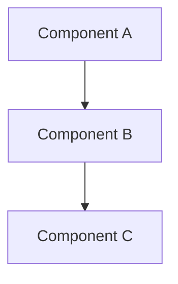

# Skill Title

## Purpose

One paragraph explaining the skill's purpose and the mental model it provides.

## Core Concepts

### Concept 1

Explanation and guidance the agent should follow.

### Concept 2

Explanation and guidance the agent should follow.

## Expert Recommendations

Key technical recommendations distilled from domain expertise:

1. **Recommendation** -- rationale and when it applies
2. **Recommendation** -- rationale and when it applies

## Decision Framework

When the user faces [situation], apply these criteria:

1. **Criterion A** -- description
2. **Criterion B** -- description
3. **Criterion C** -- description

## Trade-offs Matrix

| Approach | Strengths | Weaknesses | Best When |
|----------|-----------|------------|-----------|
| Option A | ...       | ...        | ...       |
| Option B | ...       | ...        | ...       |

## Subtle Judgments

Technical nuances that are not immediately obvious:

- **Situation**: What experienced practitioners know that isn't apparent from surface-level analysis.

## Anti-patterns

- **Anti-pattern name**: Why it fails and what to do instead.

## Diagrams

Mermaid UML diagrams to illustrate critical concepts and relationships:

## References

- See `references/` for supplementary material (Tier 3, loaded on demand).
