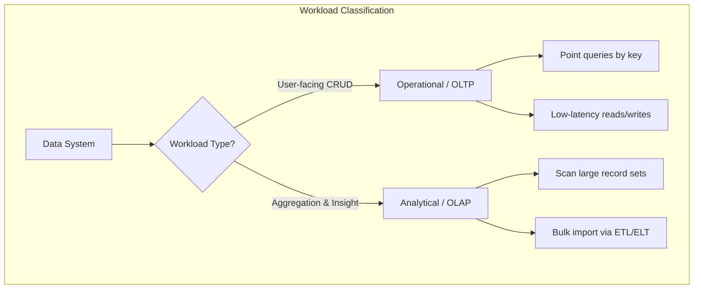
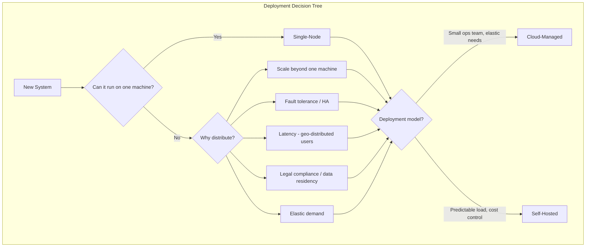
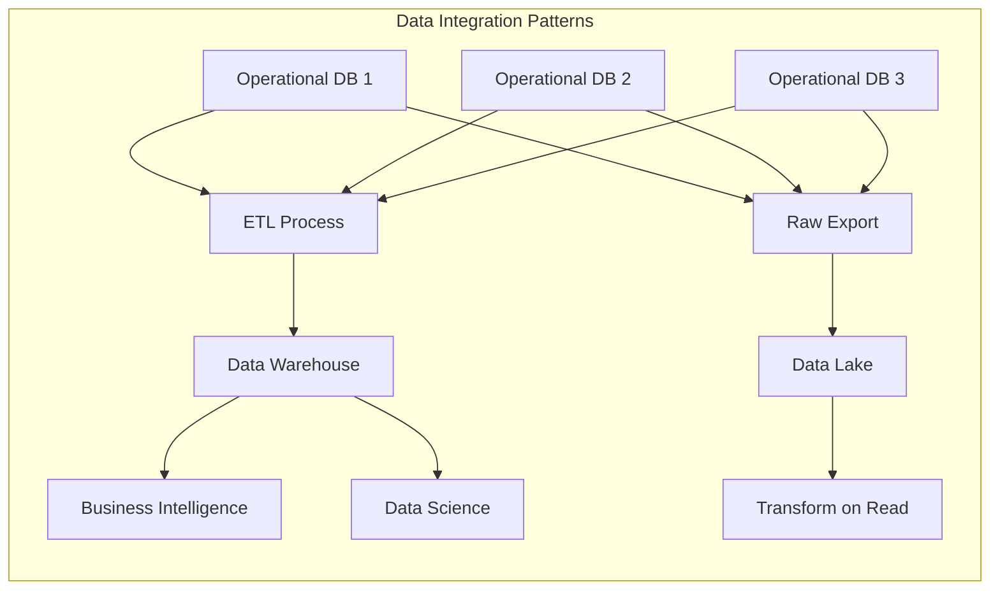
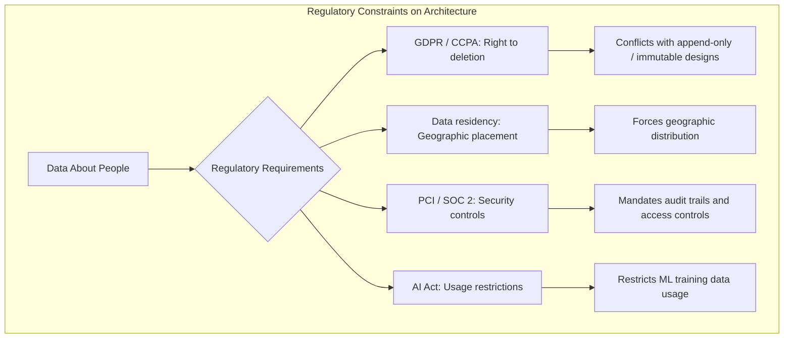

# Data Systems Architecture Trade-offs

## Purpose

Data-intensive systems require continuous trade-off reasoning -- there is no single right answer for most architectural decisions. This skill provides decision frameworks for the four major architectural dimensions: workload type (operational vs analytical), deployment model (cloud vs self-hosted), system topology (distributed vs single-node), and regulatory compliance. The guiding principle is that every choice has pros and cons; the goal is to ask the right questions to find the best fit for a particular application's needs.

## Core Concepts

### Operational vs Analytical Systems

Two fundamentally different workload types serve different audiences with different access patterns:

- **Operational (OLTP)**: Point queries fetching individual records by key. Low-latency reads and writes driven by user actions. Serves end users. Dataset size typically gigabytes to terabytes. Runs a fixed set of queries baked into application code.
- **Analytical (OLAP)**: Aggregates over large numbers of records. Bulk import via ETL or event streams. Serves internal analysts and data scientists. Dataset size typically terabytes to petabytes. Analysts write arbitrary ad-hoc queries.

These systems are typically kept separate. Two specialized roles bridge the divide: **data engineers** integrate operational and analytical systems, while **analytics engineers** model and transform data for analysts.

### Data Warehousing and the ETL Pipeline

A **data warehouse** is a separate database optimized for analytics that receives data from operational systems. This separation exists because:

- Data of interest is spread across multiple operational systems (data silos)
- Schemas optimized for OLTP are poorly suited for analytics
- Heavy analytic queries degrade operational system performance

The **ETL process** (Extract, Transform, Load) moves data from operational systems into the warehouse. A **data lake** takes a different approach: store raw data first in an object store, transform it later (sometimes called ELT).

### Cloud-Native Architecture

"Cloud-native" means far more than running traditional databases on rented VMs. The defining characteristic is **disaggregation of storage and compute**:

- Local disks on VMs are treated as ephemeral caches because instances can fail or scale away
- Virtual block devices emulate physical disks but introduce network overhead
- Cloud-native systems rely on dedicated object storage (e.g., S3) for large data and separate services for smaller metadata
- This separation allows storage and compute to scale independently

### Distributed vs Single-Node Systems

A distributed system involves multiple machines communicating via a network. Valid reasons to distribute include: inherently distributed users, fault tolerance, scalability, latency reduction, elasticity, specialized hardware, legal compliance, and sustainability.

However, distribution introduces fundamental costs: network failure modes, vastly slower cross-machine calls, consistency challenges across service boundaries, and operational complexity requiring observability tooling.

## Expert Recommendations

1. **Default to a single machine until forced otherwise** -- CPUs, memory, and disks have grown larger, faster, and more reliable. Combined with single-node databases like DuckDB, SQLite, and KuzuDB, many workloads fit on one machine. Distribution should be justified by a specific need, not assumed as a default.

2. **Bring computation to the data, not data to the computation** -- Transferring data over a network is vastly slower than local function calls. When operating on large volumes, process data where it already resides.

3. **A single-threaded program can outperform a 100+ core cluster** -- Coordination overhead in distributed systems can overwhelm the benefit of parallelism. Benchmark against a simple single-node baseline before committing to a distributed architecture.

4. **Separate OLTP and OLAP workloads even when HTAP is available** -- Many HTAP systems that claim to handle both workloads actually consist of an OLTP engine coupled with a separate analytical engine behind a unified interface. Regardless of HTAP capabilities, organizations still typically separate these workloads to prevent heavy analytic queries from degrading user-facing services.

5. **Microservices solve a people problem, not a technology problem** -- They allow independent teams to make progress without coordination. In a small company without many teams, microservices are unnecessary overhead. Implement in the simplest way possible.

6. **Evaluate serverless with eyes open on its constraints** -- FaaS imposes execution time limits, restricts runtime environments, and suffers from cold starts. The term is misleading: executions still run on servers, just potentially different ones each time. The real value is metered billing for code execution.

7. **No database is inherently a system of record or derived system** -- This depends entirely on how the application uses it. Derived data (caches, search indexes, materialized views) is technically redundant but architecturally essential for read performance.

8. **Factor in the full cost of storing data, not just the storage bill** -- Costs include liability risk from data breaches, legal costs from non-compliance, and safety risks to users. Data minimization (Datensparsamkeit) may be the right call even when storage is cheap.

## Decision Framework

When evaluating a data system architecture, work through these dimensions in order:

1. **Workload classification** -- Is this operational (serving users, low-latency CRUD) or analytical (aggregating data for insight)? This determines your entire storage and access pattern strategy.

2. **Deployment model** -- Can you justify cloud costs, or does self-hosting make sense? Consider: team size, operational burden tolerance, data residency requirements, and whether you need elastic scaling. Cloud cost-effectiveness depends heavily on your specific situation.

3. **Topology** -- Can this run on a single machine? Exhaust single-node options before distributing. If you must distribute, identify exactly which forcing function applies (scale, availability, latency, compliance, etc.).

4. **Regulatory constraints** -- What data are you collecting about people? GDPR, CCPA, PCI, SOC 2, and AI regulations may dictate where data lives, how long it's retained, and what you can do with it. These constraints can override purely technical decisions.

## Trade-offs Matrix

| Decision | Option A | Option B | Choose A When | Choose B When |
|----------|----------|----------|---------------|---------------|
| Workload | OLTP | OLAP | Serving end users, low-latency CRUD | Analytics, aggregations, ad-hoc queries |
| Data integration | ETL (warehouse) | ELT (data lake) | Well-understood schemas, structured data | Schema-on-read flexibility, raw data preservation |
| Deployment | Cloud-managed | Self-hosted | Small ops team, elastic demand, rapid iteration | Predictable workloads, cost sensitivity, strict data control |
| Topology | Single-node | Distributed | Data fits on one machine, simplicity is paramount | Scale/availability/latency/compliance forces distribution |
| Architecture | Monolith | Microservices | Small team, early stage, single-purpose app | Large org, multiple teams, independent deployment needed |
| Compute | Dedicated instances | Serverless (FaaS) | Long-running processes, predictable load, full runtime control | Bursty workloads, metered billing, short-lived functions |

## Subtle Judgments

- **Cloud-native is not "traditional DB on rented VMs"**: The real architectural shift is storage-compute disaggregation. If you're just lifting and shifting an on-prem database to a cloud VM, you're paying cloud prices for on-prem architecture. Evaluate whether you're truly leveraging cloud-native properties.

- **HTAP promises vs reality**: Systems marketing themselves as handling both OLTP and OLAP often hide two separate engines behind one interface. Even if the technology genuinely supports both, organizational practice still demands separation to protect user-facing performance from analytical load.

- **The immutability-compliance paradox**: Modern data systems are intentionally built on immutable, append-only logs. GDPR's "right to be forgotten" directly conflicts with this pattern. There are no settled answers for how to reconcile deletion from append-only logs or how to excise a user's data from ML models already trained on it. This is an active engineering challenge.

- **HPC and cloud have fundamentally different failure models**: Supercomputers handle failure by stopping the cluster and restoring from checkpoint -- unacceptable for cloud services requiring continuous availability. HPC assumes trusted, localized environments with shared memory and RDMA; cloud assumes mutually untrusting organizations across wide geographies. Do not apply HPC patterns to cloud systems or vice versa.

- **Data cost is not just dollars per gigabyte**: The full cost of storing data about people includes breach liability, regulatory fines, reputational damage, and real safety risks to users (e.g., location data revealing criminalized behavior). Sometimes the right decision is to not store data at all.

- **Observability is not optional in distributed systems**: When a distributed system is slow, determining where the problem lies requires tracing tools (OpenTelemetry, Zipkin, Jaeger) and the ability to query both high-level metrics and individual events. Budget for this from day one.

## Anti-patterns

- **Premature distribution**: Distributing a system before exhausting single-node options. Adds network failure modes, consistency challenges, and operational complexity for no benefit if data fits on one machine.

- **Shared databases between microservices**: Makes the entire database schema part of the service API. One service's queries can degrade another's performance. Each service should own its data.

- **Ignoring regulatory constraints until deployment**: Privacy regulations (GDPR, CCPA) and compliance standards (PCI, SOC 2) can fundamentally reshape data architecture. Evaluate these constraints at design time, not after the system is built.

- **"Big data" hoarding**: Storing personal data speculatively in case it's useful later. Conflicts with data minimization principles and regulatory requirements that data be collected only for specified purposes and not retained beyond necessity.

- **Treating serverless as a universal solution**: Serverless imposes execution time limits, restricted runtimes, and cold-start penalties. Evaluate these constraints against your workload requirements before committing.

## Diagrams

## References

- See `references/` for supplementary material (Tier 3, loaded on demand).
