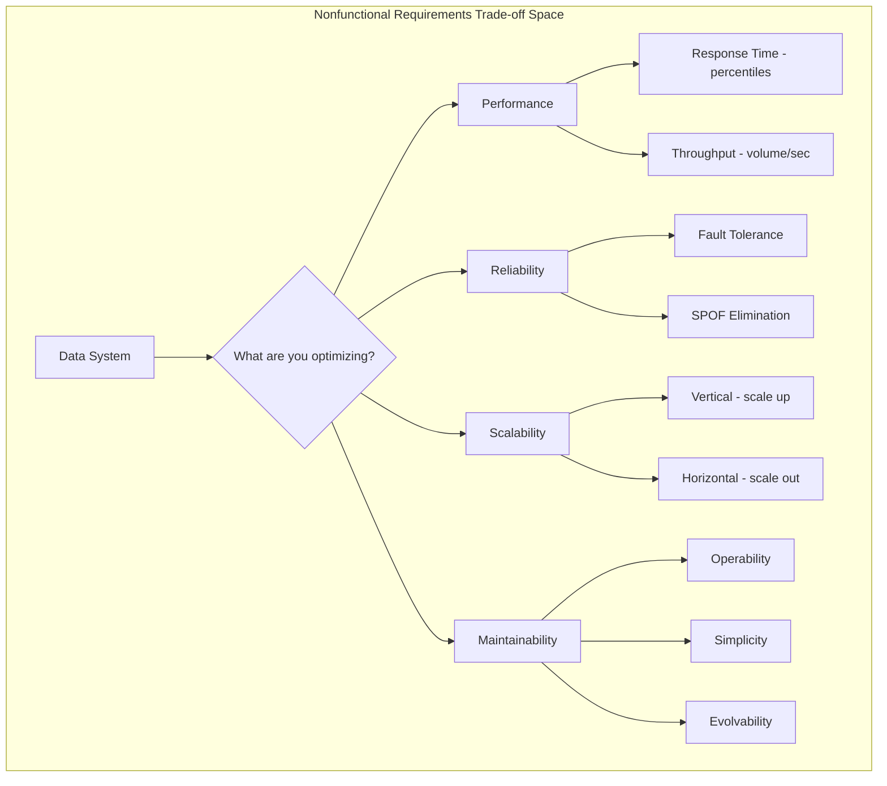
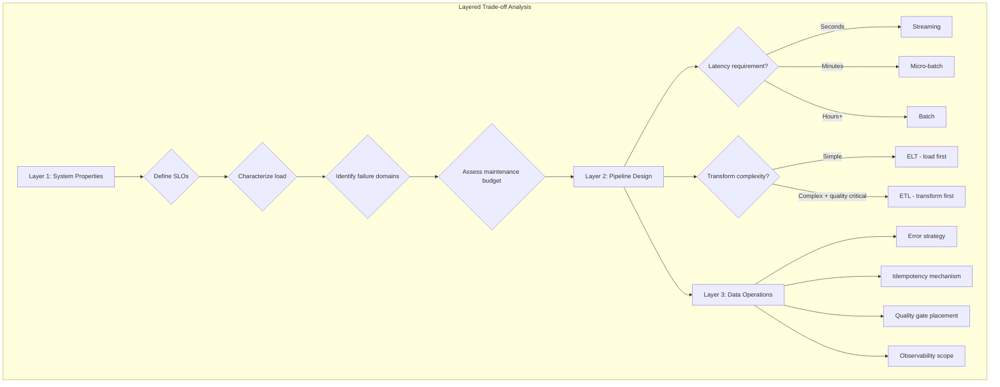
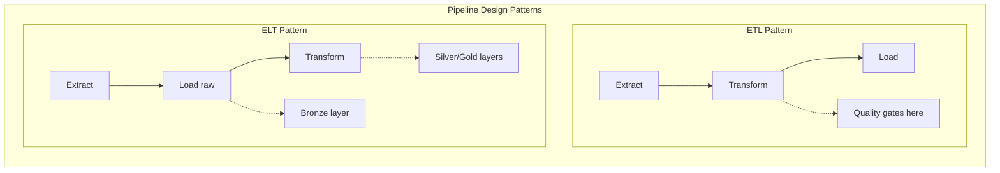
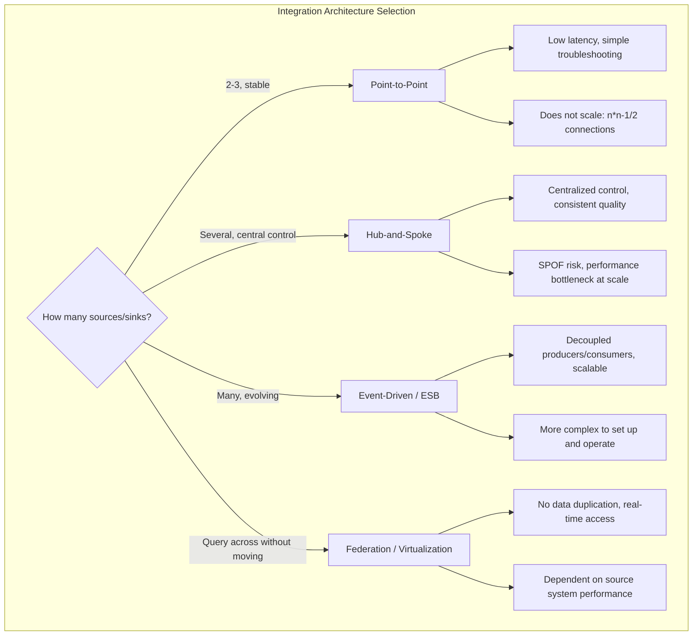
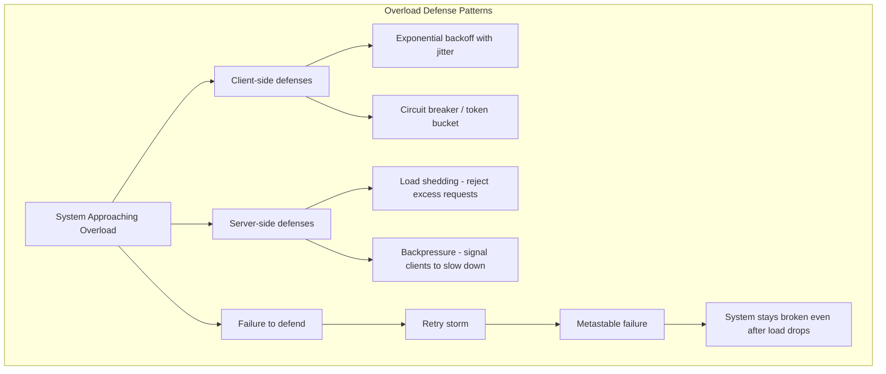
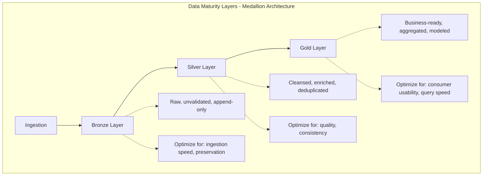

# Nonfunctional Requirements for Data Engineering Systems

## Purpose

Every data engineering decision is a trade-off. Choosing batch over streaming buys simplicity but costs latency. Adding fault tolerance improves reliability but increases complexity. Enforcing data quality gates protects downstream consumers but slows throughput. This skill provides a structured framework for reasoning about these trade-offs across three layers: system properties, pipeline design, and data operations. The goal is not to prescribe answers but to ensure the right questions are asked and the right constraints are identified before committing to an architecture.

## Core Concepts

### The Four Nonfunctional Requirements

Every data system must balance four properties. These are not independent -- improving one often degrades another.

**Performance** measures how fast a system responds and how much work it can do. Two metrics matter:

- **Response time**: elapsed time from request to answer, measured in percentiles (p50, p95, p99). The median tells you what a typical user experiences. The 99th percentile reveals your worst-case tail latency. Averages are misleading -- they hide the distribution.
- **Throughput**: requests per second or data volume per second. There is a maximum throughput for any given hardware allocation. As throughput approaches this limit, response times increase sharply due to queueing.

Response time and throughput are connected: under heavy load, queueing delays dominate. A system near overload can enter a vicious cycle -- slow responses trigger client retries, which increase load further (a **retry storm**), potentially causing a **metastable failure** that persists even after load decreases.

**Reliability** means continuing to work correctly when things go wrong. The key distinction is between faults (a component misbehaving) and failures (the system as a whole stopping service). A **fault-tolerant** system prevents faults from escalating to failures. Any component whose fault causes system failure is a **single point of failure (SPOF)**.

Fault tolerance is always bounded -- tolerating N simultaneous faults of specific types, not arbitrary catastrophes. Hardware faults (disk failures at 2-5%/year, SSD uncorrectable errors, CPU computation errors at 1-in-1000 machines) are weakly correlated. Software faults (bugs, resource exhaustion, cascading failures) are strongly correlated because many nodes run the same code.

**Scalability** describes a system's ability to cope with increased load. It is not a binary label -- "X scales" is meaningless without specifying along which dimension, under what load profile, and at what cost. The right questions are:

- If load grows in a particular way, what are our options?
- How much additional resources are needed to maintain performance?
- Based on current growth, when do we hit architectural limits?

Three scaling architectures exist:
- **Shared-memory (vertical scaling)**: more CPUs/RAM on one machine. Cost grows faster than linearly; bottlenecks limit benefit.
- **Shared-disk**: independent CPUs sharing a disk array (NAS/SAN). Contention and locking limit scalability.
- **Shared-nothing (horizontal scaling)**: distributed nodes coordinating via network. Linear scaling potential but requires explicit sharding and incurs distributed system complexity.

**Maintainability** determines long-term cost. The majority of software cost is not initial development but ongoing maintenance. Three sub-properties matter:
- **Operability**: ease of keeping the system running. Good defaults, observability, independence from individual machines.
- **Simplicity**: ease of understanding. Abstraction hides implementation detail. Unnecessary complexity introduces hidden bugs.
- **Evolvability**: ease of change. Loosely-coupled systems are easier to modify. Minimizing irreversibility improves flexibility.

### Performance Measurement

**Latency vs response time**: Response time is what the client sees (total elapsed time). Service time is active processing time. Latency is time spent waiting (network delay, queueing). Response time = network latency + queueing delay + service time + return network latency.

**Percentiles over averages**: Use p50 (median) for typical experience, p95/p99 for outlier severity. High percentiles matter most in backend services called multiple times per request -- **tail latency amplification** means one slow backend call slows the entire user request. Amazon targets p99.9 for internal services because slowest requests often come from highest-value customers.

**SLOs and SLAs**: A Service Level Objective sets a target (e.g., p99 response time < 1s, 99.9% non-error responses). A Service Level Agreement is a contract with consequences if the SLO is not met. Define SLOs for every data pipeline that serves downstream consumers.

### Overload and Backpressure

When a system approaches capacity, several defensive patterns prevent cascading failure:

- **Exponential backoff with jitter**: clients increase and randomize retry intervals
- **Circuit breakers / token buckets**: temporarily stop sending requests to a failing service
- **Load shedding**: server proactively rejects requests when approaching overload
- **Backpressure**: server sends responses asking clients to slow down

These are not optional in data pipelines -- a streaming consumer that cannot keep up with a producer must signal backpressure or risk data loss, OOM crashes, or cascading failures.

### Fault Tolerance Strategies

- **Redundancy**: RAID for disks, dual power supplies, multi-AZ deployments. Most effective when failures are independent; correlated failures (same software bug, same rack) require different strategies.
- **Rolling upgrades**: in multi-node systems, restart one node at a time without service interruption.
- **Fault injection / chaos engineering**: deliberately trigger faults to exercise and validate fault-tolerance mechanisms. Many critical bugs are due to poor error handling that is never tested until production.
- **Exactly-once semantics**: ensuring that fault recovery doesn't duplicate or drop data. Critical for data pipelines; discussed further in streaming contexts.

### Scalability Principles

- There is no generic, one-size-fits-all scalable architecture ("magic scaling sauce"). A system handling 100K requests/sec at 1KB each looks nothing like one handling 3 requests/min at 2GB each, even though both process 100MB/sec.
- Architecture appropriate for one load level is unlikely to cope with 10x that load. Rethink on every order of magnitude increase.
- Don't plan more than one order of magnitude ahead -- requirements will evolve.
- Break systems into independently operable components. This is the principle behind microservices, sharding, stream processing, and shared-nothing architectures.
- Don't make things more complicated than necessary. If a single-machine database works, prefer it. A system with 5 services is simpler than one with 50.

## Expert Recommendations

1. **Measure percentiles, not averages** -- Averages hide the distribution. A service with a 50ms average might have a 2-second p99. Use p50 for typical experience, p95/p99 for tail severity. Never average percentiles across machines or time windows -- aggregate the histograms instead.

2. **Design for the load you have, not the load you imagine** -- Premature scalability investment wastes effort in the best case and locks you into an inflexible architecture in the worst case. If you're a startup with a small user base, keep the system simple and flexible. Scalability becomes important when you have empirical evidence of where bottlenecks lie.

3. **Budget for observability from day one in distributed systems** -- When a distributed data pipeline is slow, determining whether the bottleneck is in ingestion, transformation, loading, or downstream consumption requires tracing and metrics. This is not optional infrastructure -- it is a prerequisite for operating the system.

4. **Prefer tolerating faults over preventing them** -- Except for security (where breaches are irreversible), build systems that continue operating despite component failures. Use fault injection to validate that your fault-tolerance mechanisms actually work.

5. **Treat human error as a system design problem** -- Configuration changes by operators are the leading cause of outages, not hardware failures. Build rollback mechanisms, gradual rollouts, and well-designed interfaces rather than blaming operators. Adopt blameless postmortems.

6. **Choose ETL when quality gates matter, ELT when speed and flexibility matter** -- ETL transforms before loading (data warehouse pattern); ELT loads raw data first, transforms later (data lake/lakehouse pattern). ETL gives you cleaner data in the target system. ELT preserves raw data and decouples ingestion speed from transformation compute.

7. **Match integration architecture to organizational complexity** -- Point-to-point works for small, simple integrations with low latency needs. Hub-and-spoke centralizes control but creates a SPOF. ESB/event-driven architectures scale better but are more complex to operate. Federation avoids data movement but depends on source system performance.

8. **Implement idempotency before you need retries** -- In data pipelines, retries are inevitable (network failures, upstream delays, backfills). If your pipeline isn't idempotent, every retry risks duplicating data. Build idempotency into the design from the start, not as an afterthought.

9. **Use the Medallion pattern to separate data maturity trade-offs** -- Bronze (raw, unvalidated), Silver (cleansed, enriched), Gold (business-ready). Each layer makes a different trade-off: Bronze optimizes for ingestion speed and data preservation. Silver optimizes for quality. Gold optimizes for consumer usability. Don't skip layers -- the separation is what gives you flexibility to reprocess.

## Decision Framework

When evaluating a data engineering system, work through these three layers in order:

### Layer 1: System Properties
What nonfunctional requirements dominate your context?

1. **What are your SLOs?** Define response time targets (percentiles), throughput requirements, and availability targets. If you don't have SLOs, you can't reason about trade-offs.
2. **What is your load profile?** Characterize load: requests/sec, data volume/day, read-to-write ratio, peak-to-average ratio, number of concurrent consumers.
3. **What are your failure domains?** Identify SPOFs. Determine what types of faults you must tolerate (single disk, single machine, entire availability zone, entire region).
4. **What is your maintenance budget?** How many engineers will operate this? How often do requirements change? How complex can the system be before it becomes unmaintainable?

### Layer 2: Pipeline Design
How should data move through your system?

1. **Latency requirement** -- Does the consumer need data in seconds (streaming), minutes (micro-batch), hours (batch), or days (periodic ETL)?
2. **Transformation complexity** -- Are transformations simple (filtering, renaming) or complex (joins across sources, ML feature engineering, business rule application)?
3. **Data preservation** -- Must you retain raw data for reprocessing, auditing, or regulatory compliance? If yes, prefer ELT with a Bronze layer.
4. **Integration topology** -- How many sources and sinks? Few and stable = point-to-point or hub-and-spoke. Many and evolving = ESB or event-driven.

### Layer 3: Data Operations
How will you handle the operational realities?

1. **Error strategy** -- Fail the pipeline (safe but disruptive) or dead-letter bad records (keeps pipeline running but requires monitoring and remediation)?
2. **Idempotency mechanism** -- How will retries and backfills produce the same output? Overwrite (simple), deduplication keys (precise), or append-only with downstream reconciliation?
3. **Quality enforcement** -- Where in the pipeline do quality gates live? Too early = slow ingestion. Too late = bad data reaches consumers.
4. **Observability scope** -- What metrics do you need? Pipeline latency, throughput, error rates, data freshness, schema drift, row counts, value distributions?

## Trade-offs Matrix

### System Properties

| Decision | Option A | Option B | Choose A When | Choose B When |
|----------|----------|----------|---------------|---------------|
| Performance target | Optimize response time | Optimize throughput | User-facing queries, interactive dashboards | Batch processing, bulk data movement |
| Reliability | Fault prevention | Fault tolerance | Security contexts, irreversible damage | Hardware/software faults, operational errors |
| Scaling | Vertical (scale up) | Horizontal (scale out) | Data fits one machine, simpler operations | Scale/availability/latency forces distribution |
| Scaling arch | Shared-disk | Shared-nothing | On-prem warehouse, moderate scale | Cloud-native, elastic demand, geo-distribution |
| Maintainability | Simplicity | Feature richness | Small team, evolving requirements | Stable requirements, large dedicated team |

### Pipeline Design

| Decision | Option A | Option B | Choose A When | Choose B When |
|----------|----------|----------|---------------|---------------|
| Transform timing | ETL (transform before load) | ELT (load then transform) | Quality gates critical, structured target schema | Raw data preservation, flexible exploration, large volumes |
| Delivery model | Batch | Streaming | Latency tolerance > minutes, simpler operations | Real-time requirements, event-driven consumers |
| Delivery model | Micro-batch | True streaming | Near-real-time acceptable, simpler state management | Sub-second latency, continuous processing |
| Integration | Consolidation (move data) | Virtualization (query in place) | Analytics requiring joins across sources | Real-time access, minimal data duplication |
| Integration arch | Hub-and-spoke | Event-driven (ESB/Kafka) | Centralized control, few integrations | Many producers/consumers, independent evolution |

### Data Operations

| Decision | Option A | Option B | Choose A When | Choose B When |
|----------|----------|----------|---------------|---------------|
| Error handling | Fail-fast (stop pipeline) | Dead-letter (isolate bad records) | Data correctness is paramount, small batches | High-volume pipelines, partial failure acceptable |
| Idempotency | Overwrite target | Deduplication keys | Full recompute is cheap, target supports upsert | Append-only targets, high-volume incremental |
| Quality gates | Inline validation | Post-load validation | Pipeline can tolerate latency, quality is critical | Speed of ingestion is priority, fix quality downstream |
| Observability | Metrics only | Metrics + tracing + data profiling | Single-node, simple pipeline | Distributed, multi-stage, many failure modes |

## Subtle Judgments

- **Percentile aggregation is a trap**: You cannot average p99 values across machines or time windows and get a meaningful result. The only correct approach is to merge the underlying histograms (using t-digest, HdrHistogram, DDSketch) and compute percentiles from the merged distribution. Many monitoring dashboards get this wrong.

- **Tail latency amplification compounds silently**: If a user request fans out to 7 backend services in parallel, and each has a 1% chance of being slow, the user sees a slow response ~7% of the time. The more services in the critical path, the worse the tail. This applies to data pipelines with multiple stages -- your pipeline p99 is determined by the worst stage, not the average.

- **Retry storms can be worse than the original failure**: A service near overload starts returning errors. Clients retry. Load increases. More errors. More retries. The system enters a metastable failure state that persists even after the original load spike subsides. The fix is not "retry harder" -- it's exponential backoff, circuit breakers, and load shedding. Data pipelines with automatic retry-on-failure are especially vulnerable.

- **Fault tolerance has a complexity budget**: Each fault you tolerate adds complexity -- replication, consensus, failover logic, split-brain handling. A system that tolerates every conceivable fault is too complex to understand, debug, or maintain. Choose which faults to tolerate based on likelihood and business impact. Accept that some rare events (entire region loss, solar storms) may exceed your tolerance budget.

- **ETL vs ELT is really about who owns transformation complexity**: ETL centralizes transformation before loading -- the data engineering team owns the complexity. ELT pushes raw data to storage and transforms later -- analytics engineers and consumers share the complexity. The choice is as much an organizational decision as a technical one.

- **"Real-time" is almost always "near-real-time"**: True real-time (hard deadlines, no tolerance for delay) is rare in data engineering. Most "real-time" requirements are actually "as fast as reasonably possible" -- seconds, not microseconds. Clarify the actual latency requirement before choosing streaming over batch. The operational cost difference is significant.

- **Single-node databases have gotten remarkably good**: DuckDB can process analytics on datasets that would have required a Spark cluster five years ago. SQLite handles concurrent reads well. PostgreSQL scales vertically to very large workloads. Exhaust single-node options before introducing distributed system complexity.

## Anti-patterns

- **Averaging percentiles**: Computing the mean of p99 values across shards or time buckets. This produces a number that represents no real user experience. Merge histograms instead.

- **Premature scalability engineering**: Building a distributed, sharded, multi-region pipeline for a dataset that fits on a single machine. Adds operational complexity, failure modes, and cost for no benefit at current scale.

- **Ignoring backpressure in pipelines**: A producer that writes faster than the consumer can process, with no flow control mechanism. Leads to unbounded queue growth, OOM failures, or data loss.

- **Retry without idempotency**: Automatically retrying failed pipeline runs without ensuring that reruns produce the same output. Results in duplicated records, incorrect aggregations, and data quality issues that are expensive to diagnose.

- **Quality gates only at the end**: Waiting until data reaches the Gold layer to validate quality. By then, bad data has propagated through multiple pipeline stages, making root cause analysis harder and remediation more expensive. Validate early (Bronze/Silver boundary), enforce late (Silver/Gold boundary).

- **Observability as an afterthought**: Adding monitoring after the pipeline is in production and something has already gone wrong. In distributed pipelines, diagnosing issues without tracing is guesswork. Budget for observability during design, not during incident response.

- **Conflating SLOs with SLAs**: An SLO is an internal target. An SLA is an external contract with penalties. Setting SLAs without first establishing achievable SLOs leads to contractual obligations the system cannot meet.

## Diagrams

## References

- See `references/` for supplementary material (Tier 3, loaded on demand).
